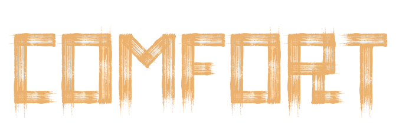

    
  

 

## Installation
Install [Millennium](https://steambrew.app/), extract Comfort-Edition folder to `.../Steam/steamui/skins`.

 

## Preview

  
Archive Old Versions

  
  (v0.1)
  

  (v0.5 ~ v0.6)
  

  (v0.7)
  

  # Toggle Left GamesList (*Test*)
  https://github.com/user-attachments/assets/e964de43-1f01-4321-8670-e2717dbf4c48

v0.8

  ## Some Features
https://github.com/user-attachments/assets/33726148-19fb-44c0-9bb9-e0c4d5317975

## ToDo:
- [x] Rework Navigation Menu
- [x] Relocate Downloads section ~~(Priority: Top position)~~ *(Note: Changed my mind)*
- [x] Rework Library Page *(Note: Concept planned)*
  - [ ] ~~Redesign "What’s New" Panel (Note: No solution yet; Changed approach)~~ *(Note: Changed my mind)*
  - [x] Fix Toggle Buttons
    - [x] Re-evaluate placement *(Optional)*
    - [x] Redesign visual appearance
- [ ] Modify Store Page *(Optional: Undecided)*
- [ ] Update Dropdown Menus
- [x] Do something with "Bottom panel"
  - [x] Rethink look
- [x] Something to invent with a URL page
- [ ] Add Options/Settings Menu *(Maybe)*
- [ ] Perfect UI Element Alignment
- [ ] Code Refactoring *(Note: Limited expertise - focus on critical improvements)*
- [ ] ...
